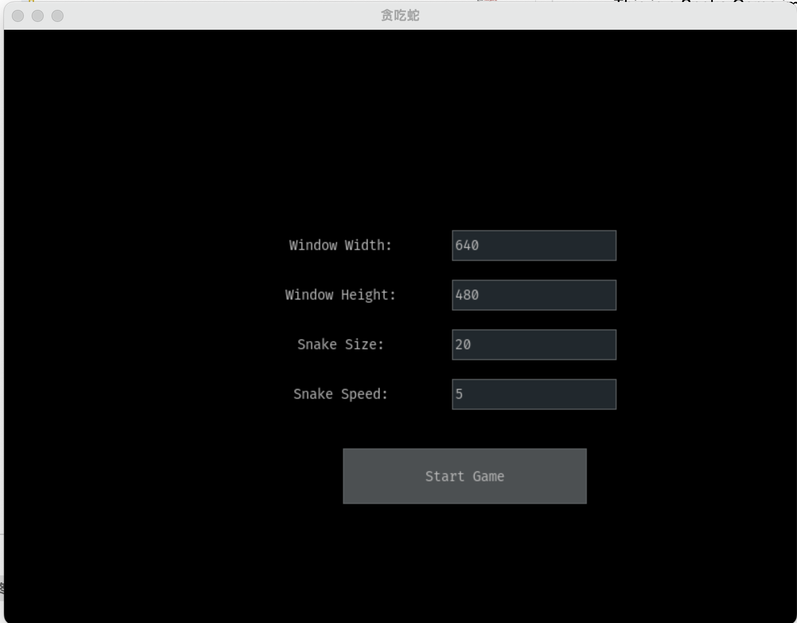
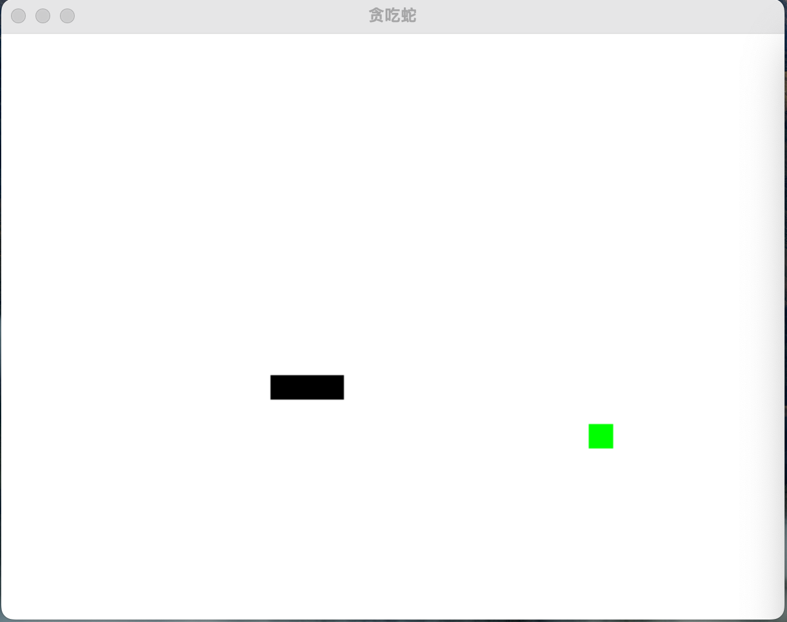
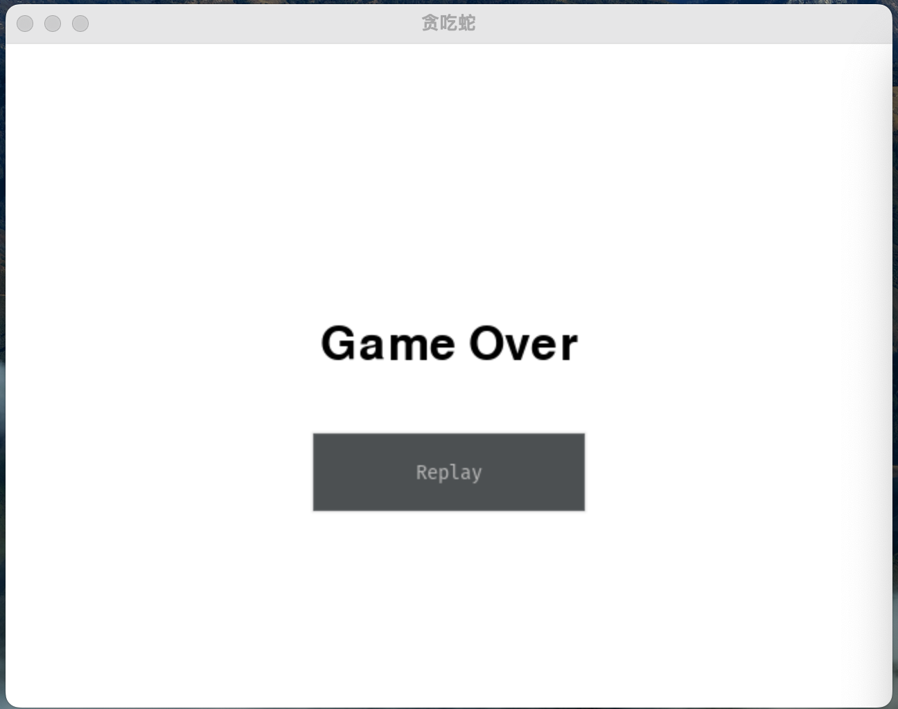

# Snake Game

This is a Snake Game implemented using Python and Pygame & pygame_gui libraries. The game offers customization options such as window size, snake size, and snake speed, along with randomly generated food items and collision detection.

## Features

1. Customizable window size, snake size, and snake speed.
2. Randomly generated food that increases the snake's length upon consumption.
3. Detection of collisions with self and screen boundaries.
4. Simple UI for setting up the game.
5. Replayable game over screen.


## Installation

To play the game, you will need Python 3.x installed on your system, along with the Pygame and pygame_gui libraries. Install them using the following commands:

```bash
pip install pygame
pip install pygame_gui
```

## Usage

Run `snake_game.py` to start the game:

```bash
python snake_game.py
```

## Demo (Unpolished Mockups)

<p>
  
  
  
</p>

## License

This project is licensed under the MIT License - see the [LICENSE](LICENSE) file for details.

## Authors

- **(Lonrun)** - _Initial work_
- **Master** - _Code assistance_

## Statistics


